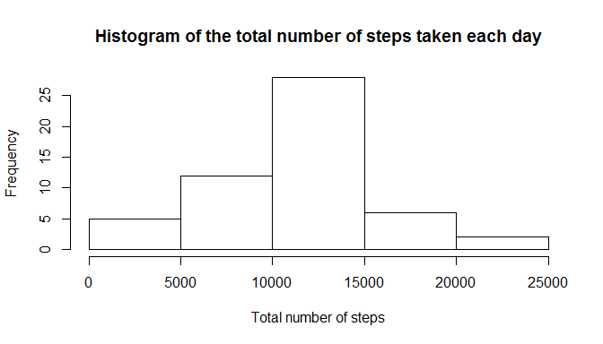
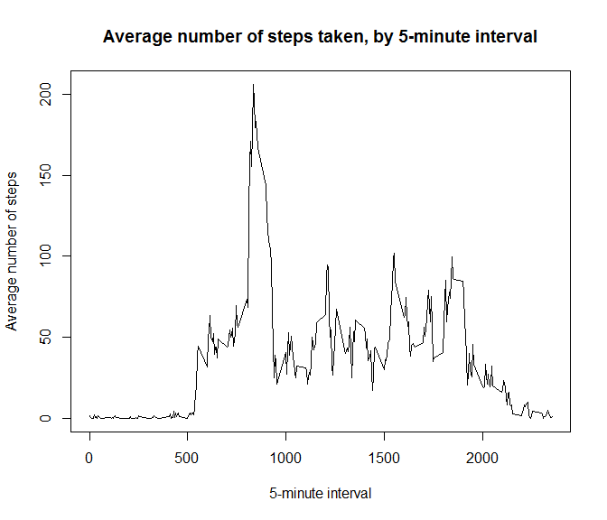
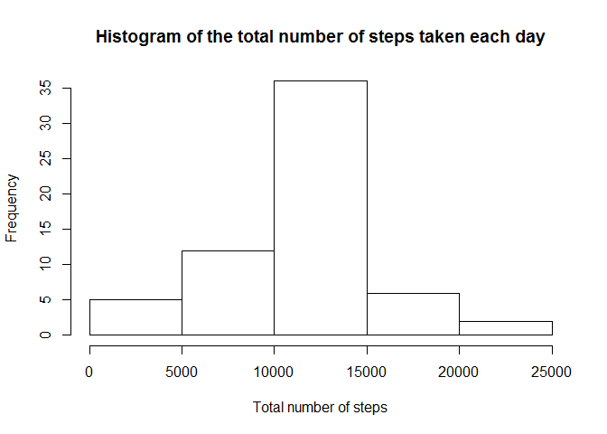
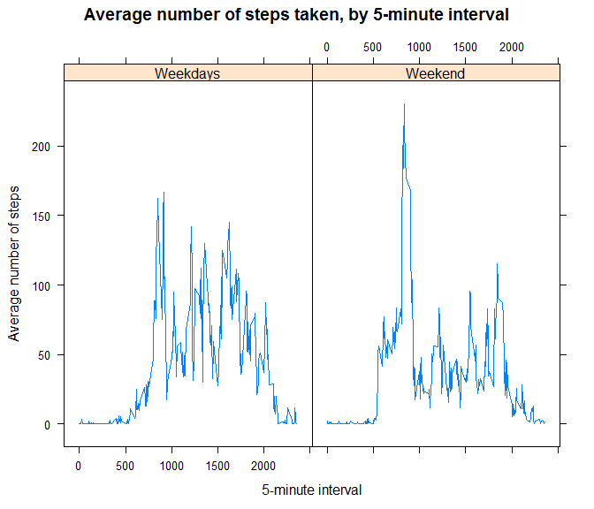

# Reproducible Research: Peer Assessment 1


## Loading and preprocessing the data

```r
dat <- read.csv("activity.csv")
dat$date <- as.character(dat$date)
dat$date <- as.Date(dat$date,format = "%Y-%m-%d")
str(dat)
```

```
## 'data.frame':	17568 obs. of  3 variables:
##  $ steps   : int  NA NA NA NA NA NA NA NA NA NA ...
##  $ date    : Date, format: "2012-10-01" "2012-10-01" ...
##  $ interval: int  0 5 10 15 20 25 30 35 40 45 ...
```


## What is mean total number of steps taken per day?

```r
q1dat <- dat[!is.na(dat$steps),]#ignoring the missing values in the dataset
#total number of steps taken per day
totSteps <- lapply(split(q1dat,q1dat$date),function(y){sum(y$steps)})
totSteps <- unlist(totSteps)
```
Making an histogram of the total number of steps taken each day

```r
hist(totSteps,breaks = 5,
     main = "Histogram of the total number of steps taken each day",
     xlab="Total number of steps")
```

 

Calculating and reporting the mean and median of the total number of steps taken per day


```r
mean(totSteps)
```

```
## [1] 10766
```

```r
median(totSteps)
```

```
## [1] 10765
```

## What is the average daily activity pattern?
Making a time series plot (i.e. type = "l") of the 5-minute interval (x-axis) and the average number of steps taken, averaged across all days (y-axis)

```r
q2dat <- dat[!is.na(dat$steps),]#ignoring the missing values in the dataset

#average number of steps taken, by 5-minute interval
avSteps <- lapply(split(q2dat,q2dat$interval),function(y){mean(y$steps)})
avSteps <- unlist(avSteps)

#ploting time series
plot(x = as.numeric(names(avSteps)),y = avSteps,type="l",
     main="Average number of steps taken, by 5-minute interval",
     xlab="5-minute interval",
     ylab="Average number of steps")
```

 

In order to answer the question, "Which 5-minute interval, on average across all the days in the dataset, contains the maximum number of steps?", we use the following code:

```r
interval <- names(avSteps)[which.max(avSteps)]
interval
```

```
## [1] "835"
```

```r
steps <- avSteps[which.max(avSteps)]
steps
```

```
##   835 
## 206.2
```

So, the maximum number of steps is finded in the interval 835, which have 206.1698 steps in average

## Imputing missing values
Calculate and report the total number of missing values in the dataset (i.e. the total number of rows with NAs)

```r
miss<-sum(apply(dat,1,function(y) {sum(is.na(y))>0}))
miss
```

```
## [1] 2304
```
The total number of rows with NAs in the data set is 2304.

In order to filling in all of the missing values in the dataset, we use the mean for that 5-minute interval. The data set newDat is equal to the original dataset but with the missing data filled in.

```r
newDat <- dat
for(i in 1:nrow(newDat))
    if(is.na(newDat$steps[i])){
        newDat$steps[i] <- avSteps[as.character(newDat$interval[i])]
        }
        
#checking that there are not more missing values in the new data set
sum(is.na(newDat))
```

```
## [1] 0
```

The following chunk make a histogram of the total number of steps taken each day and Calculate and report the mean and median total number of steps taken per day, using the new data set.


```r
q3dat <- newDat
#total number of steps taken per day
totSteps <- lapply(split(q3dat,q3dat$date),function(y){sum(y$steps)})
totSteps <- unlist(totSteps)
hist(totSteps,breaks = 5,
     main = "Histogram of the total number of steps taken each day",
     xlab="Total number of steps")
```

 

```r
mean(totSteps)
```

```
## [1] 10766
```

```r
median(totSteps)
```

```
## [1] 10766
```

Do these values differ from the estimates from the first part of the assignment?
Note that the new estimates are very close to the oll estimates, I guess this is due to the method that I used to fill the missing values, i.e, the mean of steps for each particular interval.

What is the impact of imputing missing data on the estimates of the total daily number of steps?
It seems like imputing missing data did not affect much the total daily number of step, only the frecuency.

## Are there differences in activity patterns between weekdays and weekends?
To answer this questiong, in the following chunk I create a new factor variable in the dataset with two levels -- "weekday" and "weekend" indicating whether a given date is a weekday or weekend day.

```r
q5 <- newDat
#my system in configured in Spanish languaje. So, "sábado" and "domingo" are weekend days in Spanish, this days in English are Saturday and Sunday, respectively.
newColumn <- weekdays(q5$date)
newColumn[which(weekdays(q5$date) == "sábado" | weekdays(q5$date) == "domingo")] <- "Weekend"
newColumn[weekdays(q5$date) != "sábado" & weekdays(q5$date) != "domingo"] <- "Weekday"
q5 <- cbind(q5,newColumn)
str(q5)
```

```
## 'data.frame':	17568 obs. of  4 variables:
##  $ steps    : num  1.717 0.3396 0.1321 0.1509 0.0755 ...
##  $ date     : Date, format: "2012-10-01" "2012-10-01" ...
##  $ interval : int  0 5 10 15 20 25 30 35 40 45 ...
##  $ newColumn: Factor w/ 2 levels "Weekday","Weekend": 1 1 1 1 1 1 1 1 1 1 ...
```

In the following chunk, I make a panel plot containing a time series plot (i.e. type = "l") of the 5-minute interval (x-axis) and the average number of steps taken, averaged across all weekday days or weekend days (y-axis)


```r
library(lattice)

datForPlot <- split(q5,q5$newColumn)
avStweekend <- lapply(split(datForPlot[[1]],datForPlot[[1]]$interval),function(y){mean(y$steps)})
avStweekend <- unlist(avStweekend)
avStweekend <- data.frame(interval=as.numeric(names(avStweekend)),Av=avStweekend)

avStweekday <- lapply(split(datForPlot[[2]],datForPlot[[2]]$interval),function(y){mean(y$steps)})
avStweekday <- unlist(avStweekday)
avStweekday <- data.frame(interval=as.numeric(names(avStweekday)),Av=avStweekday)

datForPlot <- rbind(avStweekday,avStweekend)
#Factor
f <- c(rep(1,nrow(avStweekday)),rep(2,nrow(avStweekend)))
f <- factor(f,labels=c("Weekdays","Weekend"))

xyplot(datForPlot$Av ~ datForPlot$interval | f, layout=c(2,1),type = "l",
        main="Average number of steps taken, by 5-minute interval",
        xlab="5-minute interval",
        ylab="Average number of steps")
```

 


